# Foodie-frontend
It is an online restaurant webapp built using React, MongoDB, NodeJS and express. The backend for this project is present in [Here](https://github.com/saloni-rakholiya/foodie). 

## Features
### User Side
- Viewing menu with and without logging in 
- Able to add to cart from menu once logged in
- Search feature and dynamic categorisation of the menu
- Custom pizza making feature that gets added to your personal menu (with cost calculated according to ingredients)
- See the order status (delivered, preparing or on the way)
- Viewing previous orders
### Admin Side
- Multiple admin logins allowed
- View all orders with most recent ones first
- Set status of the order
- Add items to menu
- Modify the menu items

## Previews
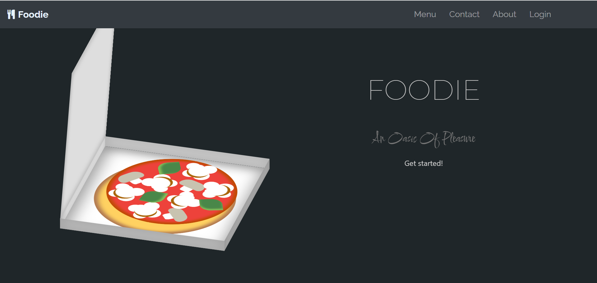
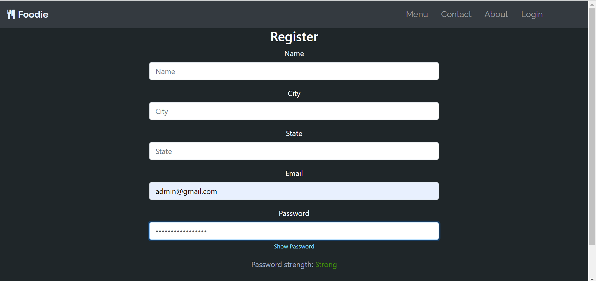
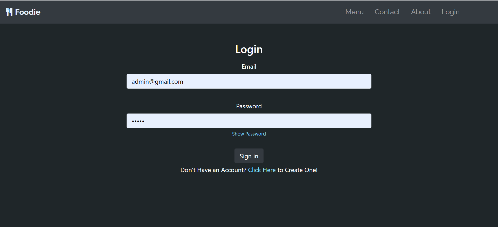
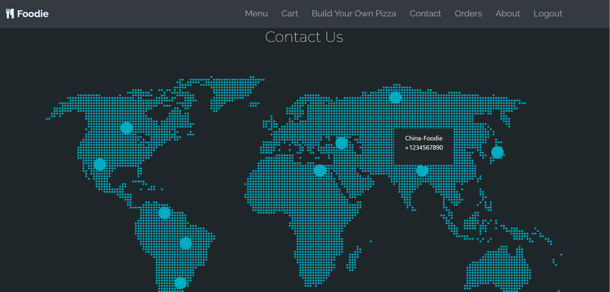
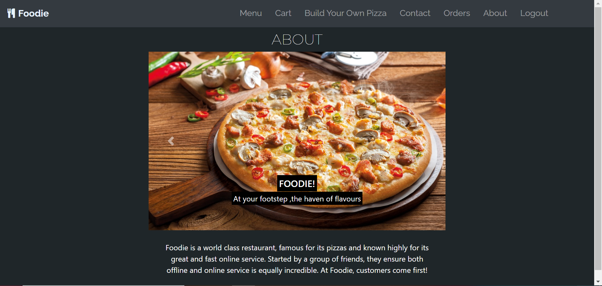
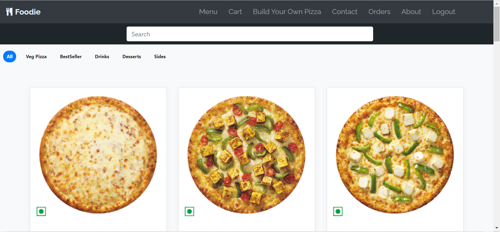
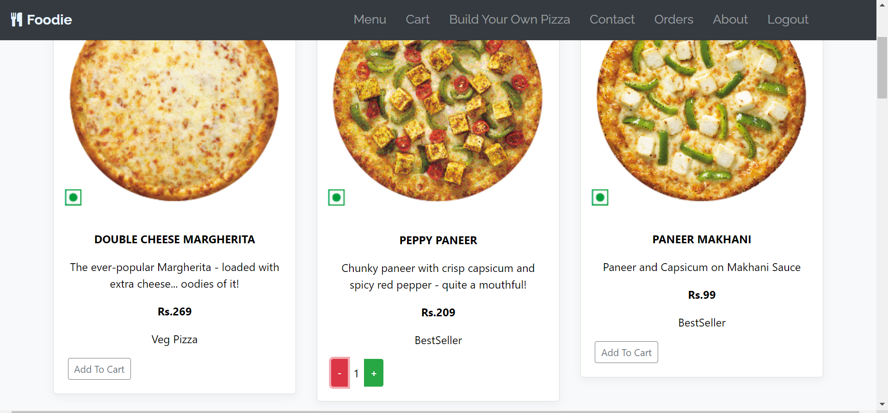
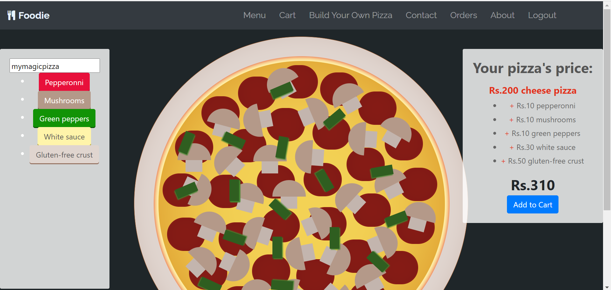

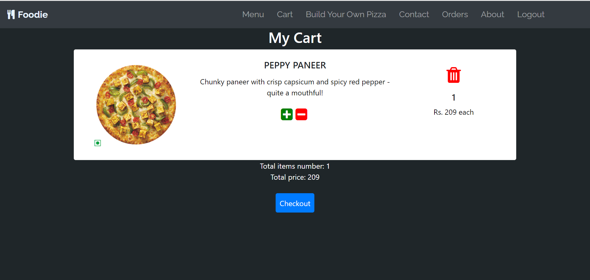
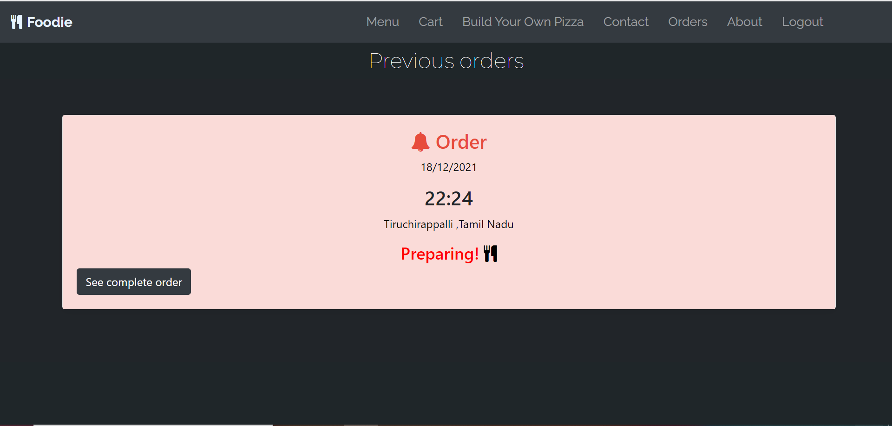
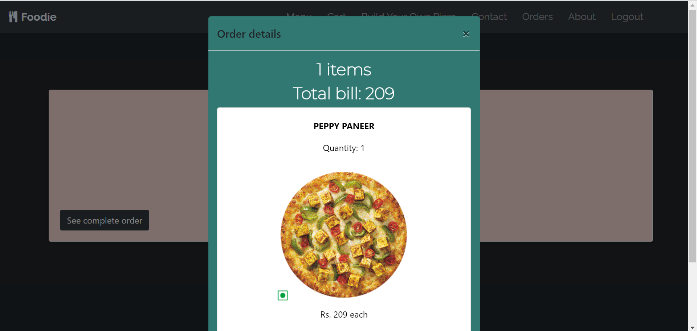
## Setup 
- Make sure the server is running by cloning the backend repo and running the following commands:
```
npm install
nodemon index.js
```
- Run mongod server by running:
```
mongod
```
- Clone this repo and run the following commands: 
```
npm install
npm start
```